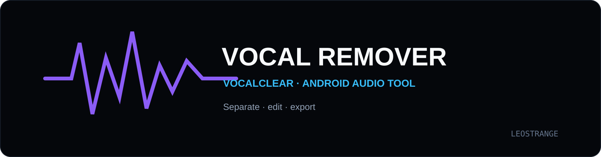
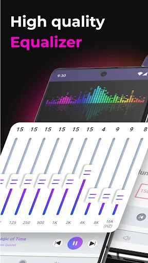
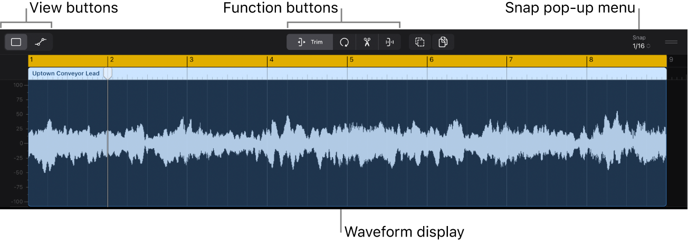

<p align="center"></p>

<p align="center"><b>Android-приложение для разделения вокала и инструментала с редактором вокальных секций.</b><br/>Онлайн- и офлайн-обработка, waveform-навигация и экспорт фрагментов.</p>

<p align="center"><code>Android</code> · <code>Kotlin</code> · <code>Jetpack Compose</code> · <code>Audio</code> · <code>Clean Architecture</code></p>

---

## Возможности

- разделение аудио на вокальную и инструментальную части;
- онлайн-режим через REST API;
- офлайн-обработка на устройстве;
- редактор вокальных секций;
- автоматическое определение участков по waveform;
- ручное создание и редактирование секций;
- экспорт отдельных фрагментов и наборов секций;
- светлая и тёмная темы интерфейса.

## Интерфейс

<p align="center"></p>

<p align="center"></p>

## Архитектура

Проект построен на **Clean Architecture + MVVM**. UI реализован на Jetpack Compose, состояние — через Kotlin Flow/StateFlow, внедрение зависимостей — Hilt.

```text
app/src/main/
├── domain/        models, repositories, use cases
├── data/          local/remote sources and implementations
├── presentation/  Compose UI, sections editor, ViewModels
└── di/            dependency injection
```

## Технологии

`Kotlin` · `Jetpack Compose` · `Material 3` · `Hilt` · `Retrofit` · `OkHttp` · `Coroutines` · `Flow` · `Android MediaCodec`

## Режимы обработки

**Online** — серверная обработка через API для сценариев, где важнее качество и доступна сеть.

**Offline** — обработка непосредственно на Android-устройстве без передачи файла на внешний сервис.

## Сборка

Требуются Android Studio, JDK 17 и Android SDK.

```bash
./gradlew assembleDebug
```

Для Windows:

```powershell
.\gradlew.bat assembleDebug
```

---

<p align="center"><b>VocalClear</b><br/><sub>Audio separation and section editing for Android.</sub></p>
